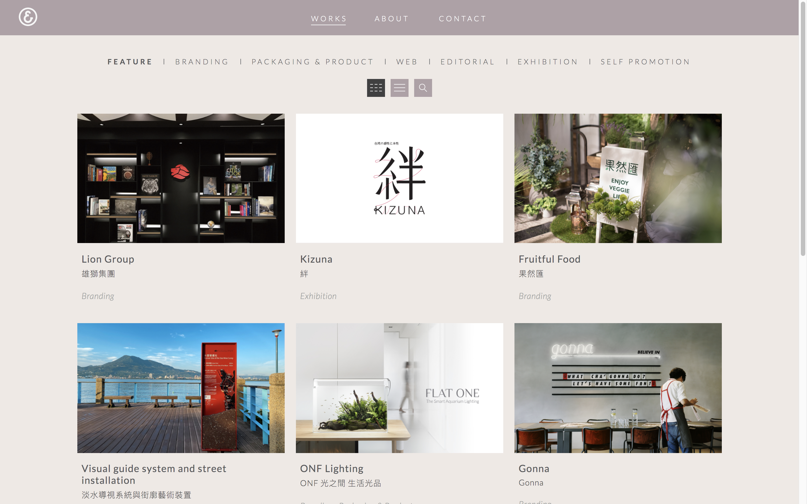
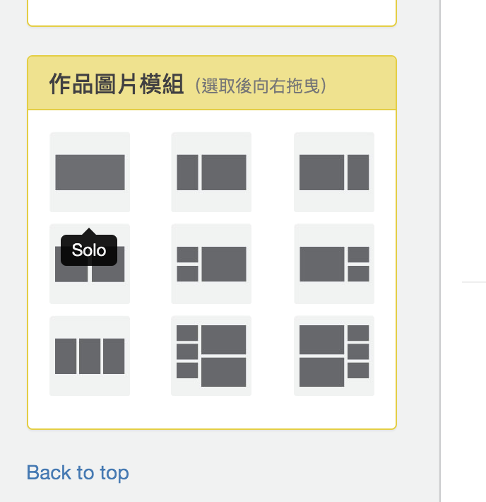
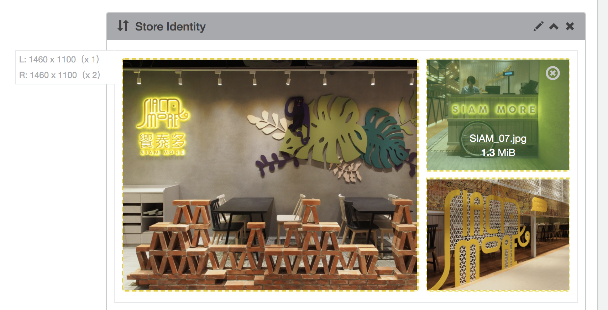
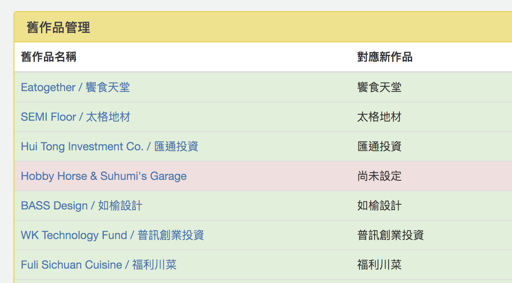

# Cizoo 囍樹設計官網

## 介紹

此專案為重寫新的設計公司官網內容管理系統。

囍樹設計成立於 2007 年，擅長打造品牌形象、企業識別，包含包裝設計、網頁設計、空間形象整合到指標系統，將概念融合到品牌細節中。成就的客戶包含法雅客、可可法朋、綠藤生機、饗食天堂等。

## 角色

我擔任全端工程師，與平面設計師合作，參與使用者體驗規劃、互動細節的設計，以及前後台的前後端程式開發，負責後台管理介面的資訊架構、視覺設計。

## 技術棧

* 前端：jQuery
* 後端：Node.js、Express.js、MongoDB
* 伺服器：PM2、Nginx、AWS EC2

## 設計

| 描述 | 細節 | 示意圖 |
| -- | -- | -- |
| 提供多種版型組合，依據不同 art-direction 情境可以自由拼裝，讓設計師可以完整地展示優秀的設計作品。 | 事前與平面設計師、需求方多次討論以及確認需求，設計 9 種最常使用的版型結構。 |  |
| 設計師可以從左側拖拉版型到編輯區域，再選擇要上傳的作品圖（也可以直接 drag-and-drop 上傳）。上傳時會顯示百分比進度提示。 | 使用 [Dropzone.js](https://www.dropzonejs.com/)。 |  |
| 上傳照片時即時自動裁切圖片素材。 | 使用 Node.js 的 [gm](https://aheckmann.github.io/gm/) 以及 [ImageMagick](http://www.imagemagick.org/) 處理圖片後製。 |  |
| 主動提議以及規劃舊資料相容計畫，校正搜尋引擎上舊系統作品資料網址，使其可以進行正確地重新導向到新的作品網址。 | - |  |
