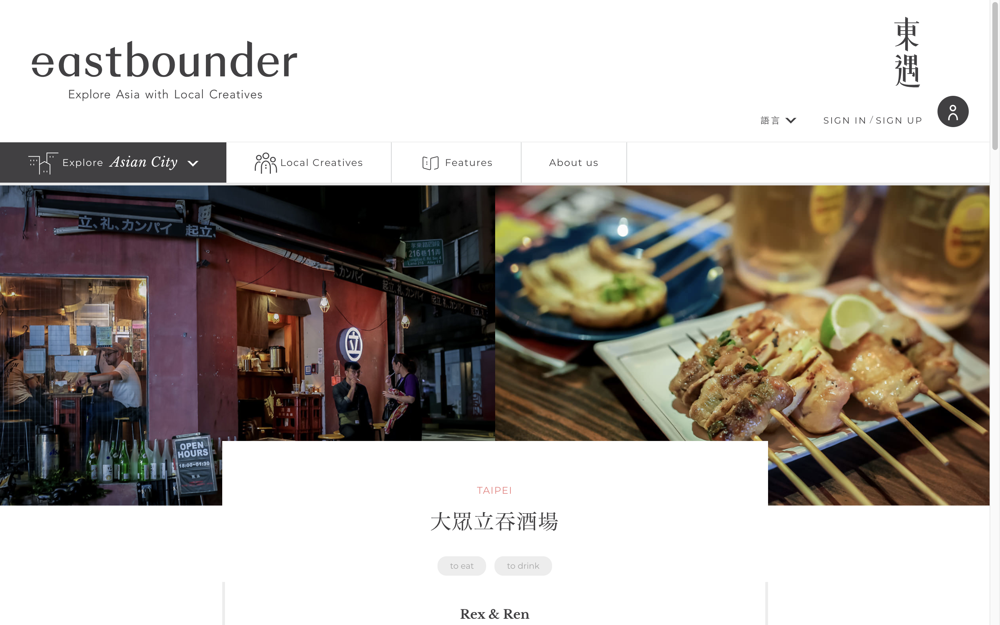
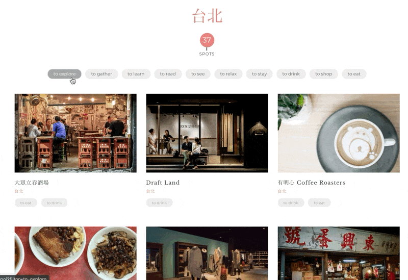
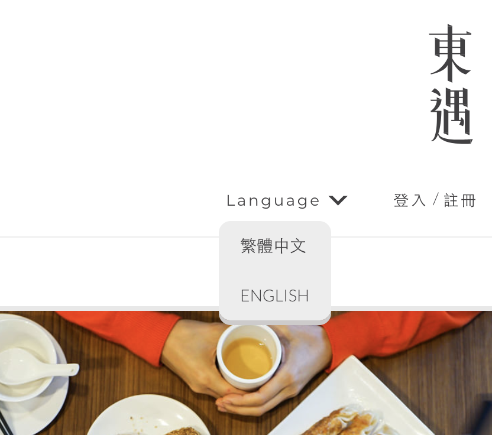
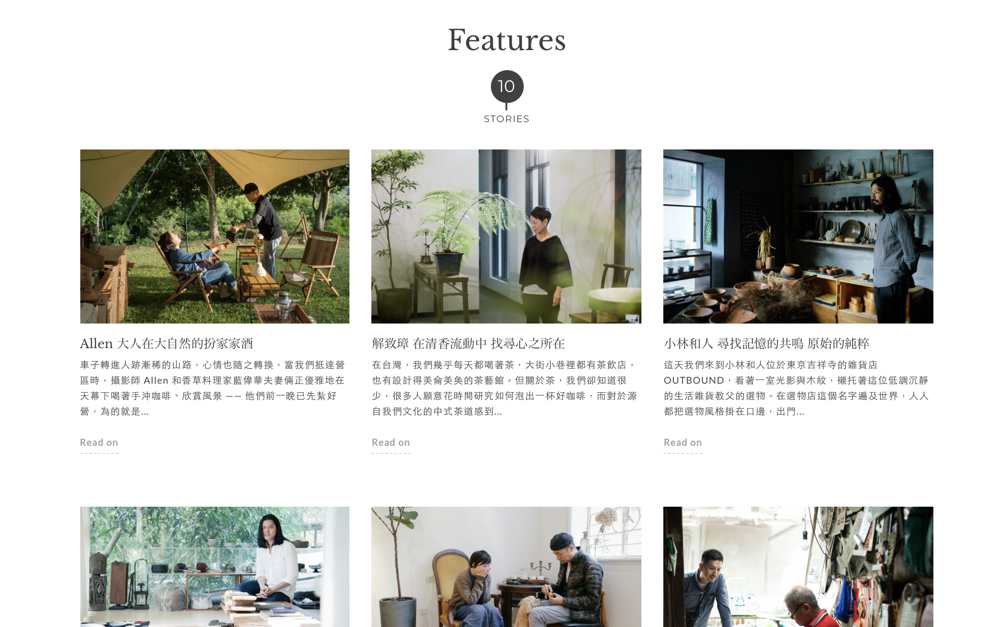

# eastbounder 東遇

## 介紹

此專案為建立人文策、地域策展的內容管理系統。

東遇 eastbounder 是由地方創作人的觀點出發，分享地區上的特色小店。

## 角色

在這個專案中，我擔任全端工程師，與平面設計師合作，參與專案企劃、功能發想、介面設計，獨立負責後台的上稿系統介面設計、功能規劃，前後端程式開發。

## 技術棧

* 前端：jQuery
* 後端：Ruby、Rails、PostgreSQL、WordPress、MySQL
* 伺服器：Passenger、Nginx、AWS EC2、PHP-FPM

## 設計

| 描述 | 細節 | 示意圖 |
| -- | -- | -- |
| 客製化地圖、座標、popup 樣式。 | - | - |
| 可以依照標籤進行篩選，完成前台動態篩選功能、動畫效果。 | 使用 [Masonry](https://masonry.desandro.com/)。 |  |
| i18n 多國語系系統建置與規劃，可由資料庫端提供多語系上稿。原先的架構支援簡體中文、日文，後來人力因素僅支援繁體中文、英文。 | |  |
| 串接 Facebook 第三方 OAuth 註冊、登入機制，以及完整的忘記密碼、確認電子郵件流程。 | - | - |
| 第三方郵件服務 SMTP 串接。 | 串接 [Mailgun](https://www.mailgun.com/) 服務。 | - |
| 建置 WordPress 部落格系統，客製化版型以及支援多國語系。 | - | - |
| 串接 WordPress 部落格 API，整合兩套系統語系設定，顯示對應的語系設定的文章列表在主站頁面。 | - |  |
