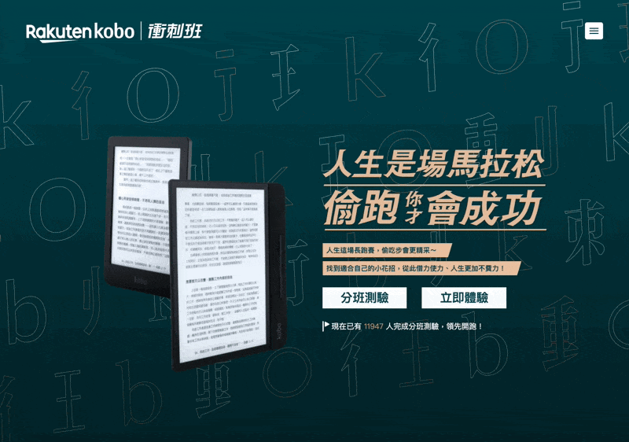
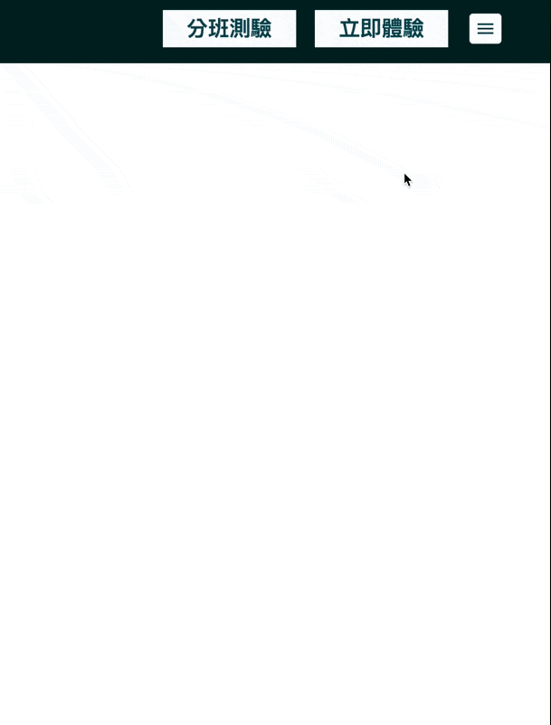
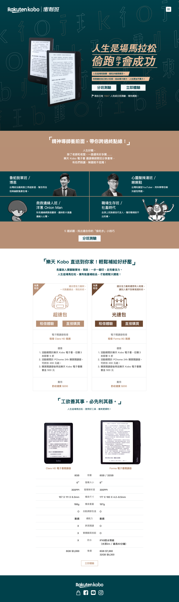

* 目前網址：https://rentkoboreader.backer-founder.com/
* 先前網址（廢棄）：https://www.rentkoboereader.com.tw/

## 負責項目

* 與另一名前端同事分工協作完成不同模組，在指定的短時間救火完成
* 我負責進入首頁的動畫、RWD、主視覺、行銷需要收集 Email 用的伺服器假設、後端程式開發（Rails）

## 新聞報導

* [不必出門就能試用電子書閱讀器！樂天 Kobo 免費租借體驗活動開跑](https://ccc.technews.tw/2019/06/19/rakuten-kobo-ereader-rental-campaign/)
